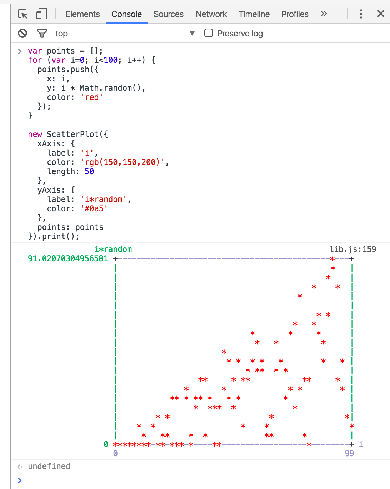

# console-scatter-plot

```
npm install --save console-scatter-plot
```

```js
import ScatterPlot from 'console-scatter-plot';

var option = {
  xAxis: {
    label: 'xLabel',
    color: 'red'
  },
  yAxis: {
    label: 'yLabel',
    color: 'blue'
  },
  points: [{x: 100, y: 30}]
};

var scatterPlot = new ScatterPlot(option);

var graph = scatterPlot.string(); // get graph as string (without color)
scatterPlot.print(); // print to console
```



[demo](https://tkrkt.github.com/console-scatter-plot)

## option

|param||default|
|---|---|---|
|xAxis|label|'x'|
||min|(auto)|
||max|(auto)|
||length|60|
||color||
||flip|false|
|yAxis|label|'y'|
||min|(auto)|
||max|(auto)|
||length|20|
||color||
||flip|false|
|points[]|x||
||y||
||marker|'\*'|
||color||


## color option

* Browser
    * CSS color style (#f00, rgb(255, 0, 0), red, ...)
* Node.js
    * black
    * red
    * green
    * yellow
    * blue
    * magenta
    * cyan
    * white
    * gray
    * grey
